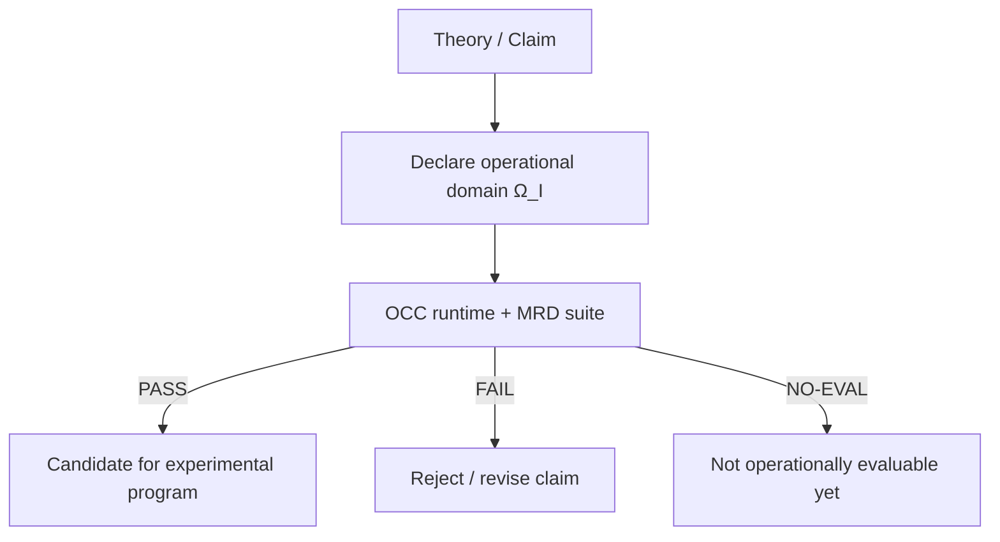

# OCC — Operational Consistency Compiler

[](https://github.com/MarcoAIsaac/OCC/actions/workflows/ci.yml)
[](LICENSE)

[](docs/RELEASING.md)
[](docs/RELEASING.md)

**OCC** es un runtime reproducible con CLI (`occ`) para ejecutar módulos MRD (inputs YAML/JSON) y emitir veredictos **PASS/FAIL/NO‑EVAL** con reportes auditables.

---

## Why OCC exists

Un problema recurrente en física teórica moderna (especialmente en BSM/UV) es la **malleabilidad UV**:
modelos con parámetros libres en regímenes de energía **operacionalmente inaccesibles** pueden ajustarse y re‑ajustarse sin quedar claramente falsables.

**Ejemplos típicos (como se discuten en la literatura):**

- *Landscapes* con enorme degeneración de vacua/puntos UV → predicciones no únicas.
- Escalas de ruptura (p. ej. SUSY/BSM) que pueden desplazarse cuando la evidencia experimental no aparece.
- Modelos efectivos donde “perillas UV” ocultas permiten *reexplicar* cualquier dato.

**La propuesta de OCC:**

OCC actúa como un **filtro operacional de etapa tardía** (*late‑stage operational filter*):
antes de llevar una afirmación física a un programa experimental, OCC verifica si la afirmación es:

1. **Evaluable** dentro de un dominio operacional declarado \(\Omega_I\) (sin escalas inmedibles / sin knobs ocultos).
2. **Consistente** con restricciones inevitables (p. ej. causalidad, unitariedad, datos mínimos).
3. **Libre de reinyección UV** (evita reintroducir libertad inobservable como “salida” del fallo).

> **OCC no es una teoría nueva.** Los experimentos siguen siendo el juez final.
> OCC filtra y prioriza propuestas **antes** de consumir recursos experimentales.

### “Killer example” (destacado)

El canon incluye una predicción explícitamente falsable (ver el compendio):

- **Predicción destacada:** correlación **EDM ↔ GW** en escenarios de **bariogénesis**.

Si quieres el mapa completo sin entrar directo a 300+ páginas, empieza aquí:

➡️ [`docs/EXECUTIVE_SUMMARY.md`](docs/EXECUTIVE_SUMMARY.md)

## Start here

- 📌 Guía rápida: [`docs/START_HERE.md`](docs/START_HERE.md)
- 🧾 Executive Summary (científico): [`docs/EXECUTIVE_SUMMARY.md`](docs/EXECUTIVE_SUMMARY.md)
- 📖 Glosario (para no‑expertos): [`docs/GLOSSARY.md`](docs/GLOSSARY.md)
- 📚 Índice canónico: [`docs/INDEX_CANONICAL.md`](docs/INDEX_CANONICAL.md)
- 📄 Compendio (PDF): [`docs/OCC_Compendio_Canonico_Completo.pdf`](docs/OCC_Compendio_Canonico_Completo.pdf)

## Visual (pipeline)



## Quickstart

### macOS / Linux

```bash
git clone https://github.com/MarcoAIsaac/OCC.git
cd OCC
python -m venv .venv
source .venv/bin/activate
python -m pip install --upgrade pip
python -m pip install -e ".[dev]"

occ --help
pytest -q
```

### Windows (PowerShell)

```powershell
git clone https://github.com/MarcoAIsaac/OCC.git
cd OCC
python -m venv .venv
.\.venv\Scripts\Activate.ps1
python -m pip install --upgrade pip
python -m pip install -e ".[dev]"

occ --help
pytest -q
```

> Nota (PowerShell): usar comillas en `".[dev]"` evita problemas con los brackets.

## Ejecutar un módulo

Ejemplo mínimo (escribe `out/report.json`):

```bash
occ run ILSC_MRD_suite_15_modulos_CANON/mrd_4f_dict/inputs/mrd_4f_dict/pass.yaml --out out/
cat out/report.json
```

Salida típica (ejemplo):

```console
$ occ run ILSC_MRD_suite_15_modulos_CANON/mrd_4f_dict/inputs/mrd_4f_dict/pass.yaml --out out/
PASS
```

## Comparativa rápida (contexto)

| Marco | Qué impone | Qué entrega | Relación con OCC |
|------:|------------|-------------|------------------|
| Bootstrap | Consistencia matemática/analítica (p. ej. restricciones de simetría, positividad) | Ventanas de parámetros / exclusiones | Complementario: OCC se centra en **evaluabilidad operacional** + reporte ejecutable |
| Swampland | Conjeturas/criterios de compatibilidad con QG | Restricciones sobre EFTs | Complementario: OCC añade el filtro de “¿esto es medible/evaluable en \(\Omega_I\)?” |
| OCC | Dominio operacional + consistencia inevitable + no‑reinyección UV | Veredicto **PASS/FAIL/NO‑EVAL** + reporte auditable | Enfoque práctico de *triage* antes de despliegue experimental |

> Nota: esta tabla es orientación. Para definiciones formales, ver el compendio y el glosario.

## Verificar la suite completa

```bash
occ verify
```

> En GitHub Actions esto se deja como workflow manual para evitar runtimes largos.

## Estructura del repo

- `occ/` → runtime + CLI
- `ILSC_MRD_suite_15_modulos_CANON/` → suite MRD canónica (15 módulos)
- `docs/` → documentación y PDFs canónicos
- `tests/` → smoke tests
- `.github/workflows/` → CI y verificación completa manual

## Licencia y cita

- Licencia: **Apache-2.0** (ver [`LICENSE`](LICENSE))
- Cita: [`CITATION.cff`](CITATION.cff) / [`CITATION.bib`](CITATION.bib)

## Preprint / DOI (recomendado)

- **ArXiv (pendiente):** publica un preprint corto (8–10 páginas) con la predicción destacada.
- **DOI (Zenodo):** enlaza este repo con Zenodo y crea un Release `v1.0.0` para obtener DOI y badge.

Guía rápida: [`docs/RELEASING.md`](docs/RELEASING.md)
